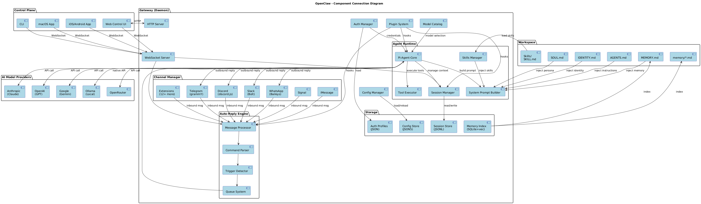
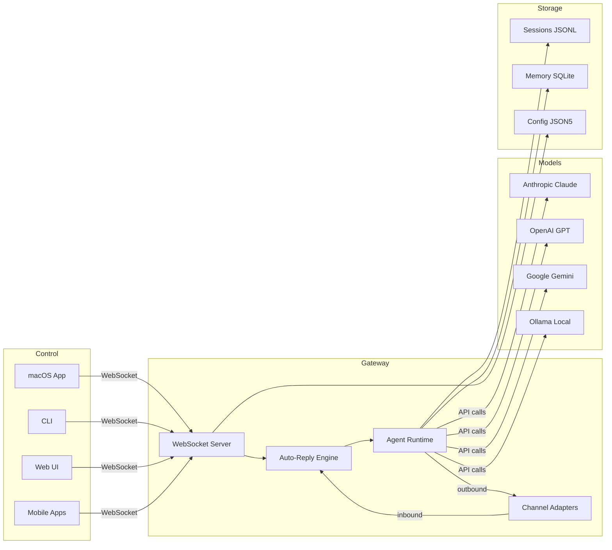
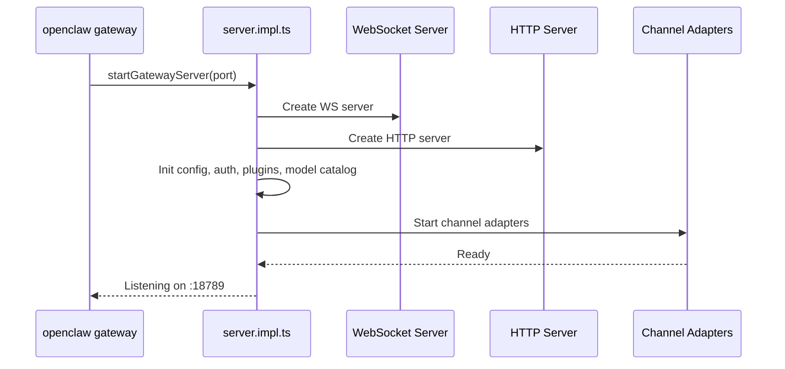
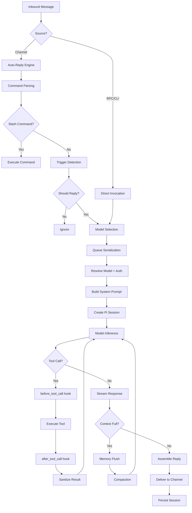
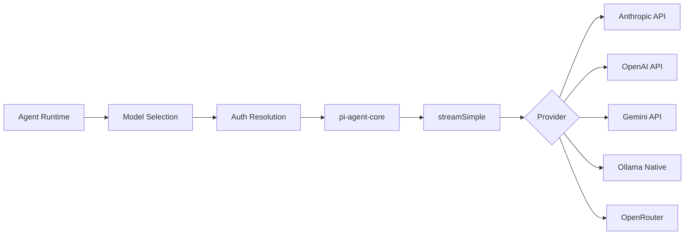
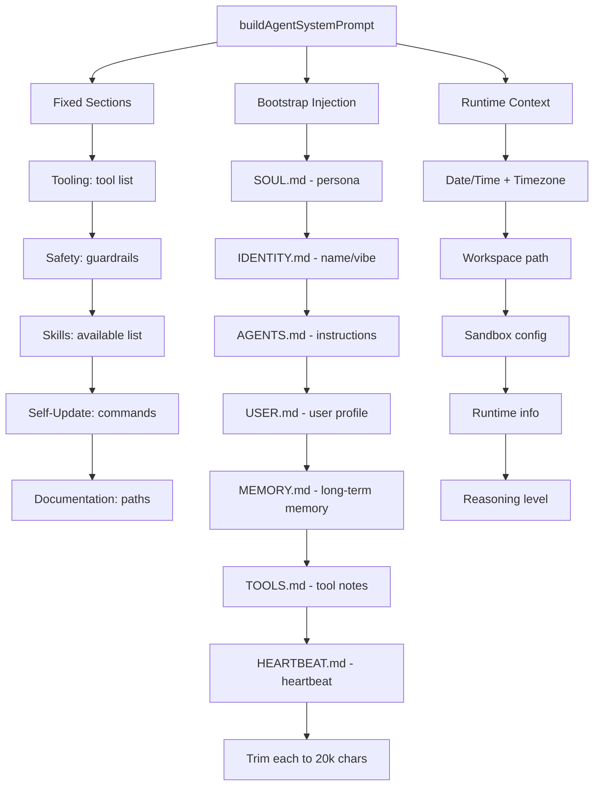

[< Back to README](./README.md)

# OpenClaw Deep Dive: Complete Architecture Guide

> **Purpose**: A comprehensive reference for AI engineers who want to understand [OpenClaw](https://github.com/openclaw/openclaw)'s architecture, internals, and design patterns — whether to contribute, learn from, or build something similar in an enterprise environment.
> For individual deep-dive docs, see the [README](./README.md).

---

## Table of Contents

1. [What is OpenClaw?](#1-what-is-openclaw)
2. [High-Level Architecture](#2-high-level-architecture) — [full doc](./01-architecture-overview.md)
3. [The Gateway (Daemon)](#3-the-gateway-daemon) — [full doc](./02-gateway-and-daemon.md)
4. [The Agent Loop](#4-the-agent-loop) — [full doc](./03-agent-loop.md)
5. [Model Providers & How AI Is Called](#5-model-providers--how-ai-is-called) — [full doc](./04-model-providers-and-calling.md)
6. [System Prompt & Soul (Persona)](#6-system-prompt--soul-persona) — [full doc](./06-soul-persona-system-prompt.md)
7. [Skills System](#7-skills-system) — [full doc](./05-skills-and-mcp.md)
8. [MCP Integration](#8-mcp-integration) — [full doc](./05-skills-and-mcp.md)
9. [Memory & Session Management](#9-memory--session-management) — [full doc](./07-memory-and-sessions.md)
10. [Plugin & Extension System](#10-plugin--extension-system) — [full doc](./08-plugin-and-extension-system.md)
11. [Web Control UI](#11-web-control-ui)
12. [Deployment & Operations](#12-deployment--operations)
13. [Key Inspirations for Enterprise Builds](#13-key-inspirations-for-enterprise-builds)

---

## 1. What is OpenClaw?

OpenClaw is a **self-hosted AI gateway** that connects LLM-powered agents to 18+ messaging platforms (WhatsApp, Telegram, Discord, Slack, Signal, iMessage, and more). It's a **universal middleware** between AI models and the chat surfaces your users live in.

### Core Philosophy

| Principle          | Description                                            |
| ------------------ | ------------------------------------------------------ |
| **Self-hosted**    | You own the data, the agent, and the infrastructure    |
| **Multi-channel**  | One agent, many messaging platforms simultaneously     |
| **Multi-model**    | Swap between Claude, GPT, Gemini, Ollama with failover |
| **Extensible**     | 55+ skills, 38+ extensions, 40+ hook types             |
| **Persona-driven** | Agents have identity, memory, and evolving personality |

### Scale

- **~510,000 lines** of TypeScript
- **639 markdown** documentation files
- **55+ skills**, **38+ extensions**, **18+ channels**
- **Node.js >= 22**, **pnpm** monorepo, **Vitest** testing

---

## 2. High-Level Architecture

```
┌─────────────────────────────────────────────────────────────────────┐
│                        CONTROL PLANE                                │
│  ┌──────────┐  ┌──────────┐  ┌──────────┐  ┌──────────────────┐   │
│  │ macOS App│  │  CLI     │  │ Web UI   │  │ Mobile (iOS/And) │   │
│  └────┬─────┘  └────┬─────┘  └────┬─────┘  └────────┬─────────┘   │
│       └──────────────┴──────────────┴─────────────────┘             │
│                              │ WebSocket (127.0.0.1:18789)          │
└──────────────────────────────┼──────────────────────────────────────┘
                               ▼
┌──────────────────────────────────────────────────────────────────────┐
│                       GATEWAY (the daemon)                           │
│                                                                      │
│  ┌──────────┐  ┌──────────┐  ┌──────────┐  ┌──────────────────┐    │
│  │WS Server │  │HTTP Svr  │  │ Canvas   │  │  Config Reloader │    │
│  │(RPC+Evt) │  │(APIs+UI) │  │ Host     │  │  Model Catalog   │    │
│  └────┬─────┘  └────┬─────┘  └──────────┘  │  Auth Manager    │    │
│       │              │                       │  Plugin System   │    │
│  ┌────┴──────────────┴────────────────────┐ └──────────────────┘    │
│  │        Channel Adapters (18+)          │                          │
│  │ WhatsApp│Telegram│Discord│Slack│Signal │ ...                     │
│  └────────────────┬───────────────────────┘                          │
│                   │                                                   │
│  ┌────────────────┴───────────────────────────────────────────┐      │
│  │              Auto-Reply Engine                              │      │
│  │  Intake → Commands → Triggers → Queue → Agent Invocation  │      │
│  └────────────────────────┬───────────────────────────────────┘      │
│                           │                                           │
│  ┌────────────────────────┴───────────────────────────────────┐      │
│  │              Agent Runtime (pi-agent-core)                  │      │
│  │  System Prompt │ Session │ Tools │ Skills │ Streaming      │      │
│  └────────────────────────┬───────────────────────────────────┘      │
│                           │                                           │
│  ┌────────────────────────┴───────────────────────────────────┐      │
│  │              Model Providers                                │      │
│  │  Anthropic │ OpenAI │ Google │ Ollama │ OpenRouter │ ...   │      │
│  └────────────────────────────────────────────────────────────┘      │
│                                                                      │
│  ┌────────────────────────────────────────────────────────────┐      │
│  │              Storage Layer                                  │      │
│  │  Sessions(JSONL) │ Memory(SQLite+vec) │ Config(JSON5)     │      │
│  └────────────────────────────────────────────────────────────┘      │
└──────────────────────────────────────────────────────────────────────┘
```

### Component Connection Diagram



> Full PlantUML source: [10-component-connections.puml](./10-component-connections.puml)

### Component Interaction Summary



---

## 3. The Gateway (Daemon)

The Gateway is the **central process** — a single long-lived daemon per host that manages everything.

### Gateway Startup



### WebSocket Protocol

| Frame Type | Direction        | Format                                |
| ---------- | ---------------- | ------------------------------------- |
| Request    | Client → Gateway | `{type:"req", id, method, params}`    |
| Response   | Gateway → Client | `{type:"res", id, ok, payload/error}` |
| Event      | Gateway → Client | `{type:"event", event, payload, seq}` |

**Key methods**: `agent`, `agent.wait`, `chat.send`, `sessions.list`, `config.patch`, `health`, `status` (46+ total)

### Daemon Service Management

| Platform | Manager  | Config                          |
| -------- | -------- | ------------------------------- |
| macOS    | launchd  | `~/Library/LaunchAgents/` plist |
| Linux    | systemd  | `~/.config/systemd/user/` unit  |
| Windows  | schtasks | Windows Task Registry           |

Commands: `openclaw daemon start|stop|restart|status|logs`

### Security

- First frame must be `connect` (hard close otherwise)
- Device-based auth with token exchange
- Gateway-level token (`OPENCLAW_GATEWAY_TOKEN`)
- Pairing approval for new devices
- Local auto-approval, non-local requires signed challenge nonce
- Rate limiting on connections and messages

---

## 4. The Agent Loop

The agent loop is the core engine: **intake → context assembly → model inference → tool execution → streaming replies → persistence**.

### Complete Flow



### The Pi-Agent Stack

OpenClaw wraps three packages from `@mariozechner`:

```
OpenClaw Agent Runtime
    └── pi-coding-agent  →  createAgentSession(), tool defs
        └── pi-agent-core  →  Agent loop orchestration, events
            └── pi-ai  →  streamSimple(), model API abstraction
```

### Queueing

- Runs are **serialized per session** (prevents concurrent state mutation)
- Optional **global queue** for system-wide serialization
- Queue modes: `collect` (batch), `steer` (route), `followup` (chain)

### Hook Points

| Hook                 | When                   | Use Case                 |
| -------------------- | ---------------------- | ------------------------ |
| `agent:bootstrap`    | Before prompt assembly | Add/swap bootstrap files |
| `before_agent_start` | Before run             | Inject context           |
| `before_tool_call`   | Before tool exec       | Block/modify tools       |
| `after_tool_call`    | After tool result      | Transform results        |
| `agent_end`          | After completion       | Inspect results          |
| `message_received`   | Inbound msg            | Pre-process              |
| `message_sending`    | Before reply           | Modify outgoing          |

### Timeouts

- Agent runtime: **600s** (configurable)
- `agent.wait`: **30s** (just the wait, not the run)

---

## 5. Model Providers & How AI Is Called

### The Call Chain



### Supported Providers

**Tier 1 (Primary)**
| Provider  | Key Models                         | Auth                 |
| --------- | ---------------------------------- | -------------------- |
| Anthropic | claude-opus-4-6, claude-sonnet-4-5 | API key, setup-token |
| OpenAI    | GPT-4o, GPT-5                      | API key, Codex OAuth |
| Google    | Gemini 2.5 Pro/Flash               | API key, OAuth       |

**Tier 2**: Ollama (local), OpenRouter (100+ models), AWS Bedrock, GitHub Copilot, QianFan, Minimax, Kimi, Z.AI

### Model Selection & Failover

```
1. Primary model (agents.defaults.model.primary)
2. Fallbacks (agents.defaults.model.fallbacks) — in order
3. Provider auth failover (rotate auth profiles within provider)
4. Image model fallback (when primary can't accept images)
```

### Tool Schema Adaptation

Different models need different tool formats:
- **Claude**: Anthropic-specific parameter groups
- **OpenAI**: Standard function calling
- **Google**: Cleaned schemas (unsupported fields removed)
- **Ollama**: Simplified tool format

### Extended Thinking

Levels: `off` → `minimal` → `low` → `medium` → `high` → `xhigh`

### Prompt Caching

System prompt designed for cache stability:
- Only timezone (no dynamic clock) in time section
- Deterministic tool list
- Static bootstrap files between runs

---

## 6. System Prompt & Soul (Persona)

### How the System Prompt is Built

The system prompt is **dynamically assembled** by `buildAgentSystemPrompt()` — it's OpenClaw-owned, not the default pi-coding-agent prompt.



### Prompt Modes

| Mode      | For           | Includes                               |
| --------- | ------------- | -------------------------------------- |
| `full`    | Main agent    | Everything                             |
| `minimal` | Sub-agents    | Core only (tooling, safety, workspace) |
| `none`    | Bare identity | One-liner                              |

### SOUL.md: The Agent's Personality

```markdown
# SOUL.md - Who You Are

_You're not a chatbot. You're becoming someone._

## Core Truths
- Be genuinely helpful, not performatively helpful
- Have opinions (you're not a search engine)
- Be resourceful before asking
- Earn trust through competence
- Remember you're a guest (in someone's life)

## Boundaries
- Private things stay private
- Ask before acting externally
- Never send half-baked replies
- You're not the user's voice in group chats

## Continuity
Each session, you wake up fresh.
These files ARE your memory. Read them. Update them.
```

**Key insight**: The agent can **edit its own SOUL.md** — personality evolves over time.

### IDENTITY.md: The Agent's Face

```markdown
- Name: Clawd
- Creature: Space Lobster
- Vibe: Resourceful, slightly mischievous
- Emoji: 🦞
```

### BOOTSTRAP.md: First-Run Ritual

On first run, a guided conversation helps the user and agent collaboratively define identity. Deleted after first use.

### Hook-Based Persona Swapping

The `agent:bootstrap` hook can swap SOUL.md per-session — different personas for DMs vs support vs groups.

---

## 7. Skills System

Skills are **modular agent capabilities** loaded on-demand.

### Architecture

```
Skills Sources:
  1. Bundled (skills/)        — 55+ built-in
  2. Managed (~/.openclaw/)   — Downloaded/installed
  3. Workspace (workspace/)   — Project-specific

Loading Flow:
  loadWorkspaceSkillEntries() → buildWorkspaceSkillSnapshot()
  → inject into system prompt as compact XML list
  → model reads SKILL.md when needed
```

### Skill Anatomy

```
skills/github/
├── SKILL.md     # Manifest + instructions
├── install.sh   # Installation script
└── config.json  # Configuration schema
```

### Categories (55+ skills)

| Category      | Examples                            |
| ------------- | ----------------------------------- |
| AI & Content  | coding-agent, image-gen, whisper    |
| Productivity  | notion, obsidian, trello, 1password |
| Communication | github, slack, email (himalaya)     |
| Media         | spotify, video-frames, camera       |
| Smart Home    | philips-hue, sonos, eight-sleep     |
| System        | tmux, healthcheck, model-usage      |

### How Skills Appear in the Prompt

```xml
<available_skills>
  <skill>
    <name>GitHub</name>
    <description>Interact with GitHub repos</description>
    <location>/path/to/skills/github/SKILL.md</location>
  </skill>
</available_skills>
```

The model uses `read` to load the SKILL.md when it needs the skill. This keeps the base prompt small.

---

## 8. MCP Integration

OpenClaw integrates MCP through the **mcporter skill** — a CLI tool for managing MCP servers:

```
mcporter list                         # List MCP servers
mcporter list <server> --schema       # List server tools
mcporter call <server.tool> key=value # Call MCP tool
mcporter auth <server>                # Authenticate
mcporter config add|remove|import     # Manage config
```

### MCP vs Native Skills

| Aspect      | Skills            | MCP               |
| ----------- | ----------------- | ----------------- |
| Discovery   | SKILL.md          | mcporter list     |
| Invocation  | Direct tool       | mcporter call     |
| Standard    | OpenClaw-specific | Industry standard |
| Performance | Native            | IPC overhead      |

**Use Skills** for deep OpenClaw integration. **Use MCP** for standard protocol compatibility.

---

## 9. Memory & Session Management

### Memory Architecture

```
Layer 1: Bootstrap Injection (per turn)
  └── MEMORY.md injected into system prompt (main session only)

Layer 2: Daily Logs
  └── memory/YYYY-MM-DD.md (append-only, today+yesterday at start)

Layer 3: Vector Search (on-demand)
  └── SQLite + sqlite-vec, BM25 + vector hybrid search

Layer 4: QMD Backend (experimental)
  └── BM25 + vectors + reranking, local-first sidecar
```

### Vector Search

- **Hybrid**: 70% vector similarity + 30% BM25 keyword
- **Embedding providers**: OpenAI, Gemini, Voyage, Local (GGUF)
- **Tools**: `memory_search` (semantic), `memory_get` (file read)
- **Auto-reindex** on file changes (debounced 1.5s)

### Pre-Compaction Memory Flush

Before context compaction, OpenClaw runs a silent turn asking the model to save important notes to disk. This prevents memory loss during compaction.

### Session Management

**Session keys**:
- DMs: `agent:<id>:main` (shared) or `agent:<id>:dm:<peer>` (isolated)
- Groups: `agent:<id>:<channel>:group:<id>`
- Cron: `cron:<job.id>`

**Storage**: `~/.openclaw/agents/<id>/sessions/sessions.json` + JSONL transcripts

**Reset modes**: Daily (4am default), idle timeout, or both (first expires wins)

**DM Security**: `dmScope: "per-channel-peer"` isolates per-user sessions (critical for multi-user setups).

---

## 10. Plugin & Extension System

### Four Layers of Extensibility

```
1. Gateway Hooks     — Shell scripts triggered by events
2. Plugin Hooks      — 40+ lifecycle hooks (TypeScript)
3. Extensions (38)   — Channel adapters + feature modules
4. Skills (55+)      — Agent-facing capabilities
```

### Extensions (38)

**Channel Extensions**: Discord, Slack, Telegram, Signal, iMessage, Teams, Matrix, Mattermost, LINE, Twitch, IRC, Google Chat, Nostr, Zalo, BlueBubbles, Tlon

**Feature Extensions**: memory-core, memory-lancedb, talk-voice, llm-task, voice-call, open-prose, device-pair, thread-ownership, lobster

**Auth Extensions**: google-antigravity-auth, google-gemini-cli-auth, minimax-portal-auth, qwen-portal-auth, copilot-proxy

### Plugin SDK

Published at `dist/plugin-sdk/index.js` with TypeScript declarations for extension developers.

---

## 11. Web Control UI

**Framework**: Lit Web Components + Vite

```
ui/
├── src/
│   ├── main.ts          # Entry
│   ├── ui/
│   │   ├── app.ts       # Main LitElement
│   │   ├── gateway.ts   # WebSocket client
│   │   ├── controllers/ # Reactive controllers
│   │   └── views/       # 50+ view components
│   │       ├── chat     # Real-time chat
│   │       ├── channels # Channel config
│   │       ├── sessions # Session management
│   │       ├── overview # Dashboard
│   │       └── usage    # Metrics
│   └── styles/
└── public/
```

Connects to Gateway via WebSocket for real-time updates.

---

## 12. Deployment & Operations

### Deployment Options

| Method     | Config                              |
| ---------- | ----------------------------------- |
| Docker     | `Dockerfile`, `docker-compose.yml`  |
| Fly.io     | `fly.toml`                          |
| Render.com | `render.yaml`                       |
| VPS        | systemd unit files                  |
| Local      | launchd (macOS), schtasks (Windows) |

### Essential Commands

```bash
openclaw gateway          # Start gateway (foreground)
openclaw daemon start     # Start as background service
openclaw onboard          # Interactive setup wizard
openclaw status           # Check system status
openclaw models status    # Check model configuration
openclaw channels status  # Check channel health
openclaw logs --follow    # Tail logs
```

### Configuration

Single JSON5 file: `~/.openclaw/openclaw.json`

```json5
{
  agents: {
    defaults: {
      workspace: "~/.openclaw/workspace",
      model: {
        primary: "anthropic/claude-sonnet-4-5",
        fallbacks: ["openai/gpt-4o"]
      }
    }
  },
  channels: {
    whatsapp: { allowFrom: ["+1555..."] },
    telegram: { botToken: "..." }
  },
  session: { dmScope: "per-channel-peer" }
}
```

---

## 13. Key Inspirations for Enterprise Builds

If you're building something similar to OpenClaw in an enterprise environment, here are the architectural patterns worth studying:

### 1. Gateway-Centric Architecture

**Pattern**: Single long-lived process owns all messaging surfaces.

**Why it works**: Eliminates coordination complexity. One process, one config, one source of truth.

**Enterprise adaptation**: Consider running multiple gateway instances behind a load balancer for HA, with shared session storage (Redis/Postgres instead of JSONL files).

### 2. Multi-Model Failover

**Pattern**: Primary → Fallbacks → Auth rotation per provider.

**Why it works**: No single point of failure for AI capabilities. If Claude is down, fall back to GPT.

**Enterprise adaptation**: Add SLA-aware routing (latency, cost, compliance). Add model-specific quality gates.

### 3. Dynamic System Prompt Assembly

**Pattern**: Build the prompt programmatically with injected context files, not static templates.

**Why it works**: Keeps prompts DRY, enables per-run customization, supports persona swapping via hooks.

**Enterprise adaptation**: Add prompt versioning, A/B testing, and audit logging for compliance.

### 4. Skills as Lazy-Loaded Capabilities

**Pattern**: List skills in the prompt, let the model read SKILL.md on demand.

**Why it works**: Keeps base prompt small. Skills only consume tokens when actually used.

**Enterprise adaptation**: Add skill access control (RBAC), usage tracking, and approval workflows.

### 5. Bootstrap File Persona System

**Pattern**: SOUL.md, IDENTITY.md as agent "DNA" injected every turn.

**Why it works**: Consistent personality without fine-tuning. Agent can self-evolve.

**Enterprise adaptation**: Centralize persona management. Version control personas. Add persona compliance checks.

### 6. Hybrid Memory (Vector + BM25)

**Pattern**: Combine semantic vector search with keyword-based BM25.

**Why it works**: Catches both paraphrases (vector) and exact tokens (BM25).

**Enterprise adaptation**: Use a proper vector DB (Pinecone, Weaviate, Qdrant) for scale. Add access control on memory segments.

### 7. Pre-Compaction Memory Flush

**Pattern**: Silent turn before compaction asks the model to save important context.

**Why it works**: Prevents memory loss when context window fills up.

**Enterprise adaptation**: Critical for long-running enterprise agents. Add structured extraction for compliance.

### 8. Hook-Based Extensibility

**Pattern**: 40+ hook types at every lifecycle stage.

**Why it works**: Deep customization without forking core code.

**Enterprise adaptation**: Add hook sandboxing, timeout enforcement, and audit logging.

### 9. Channel Adapter Pattern

**Pattern**: Common interface for all messaging platforms.

**Why it works**: Add new channels without touching core logic.

**Enterprise adaptation**: Add enterprise channels (ServiceNow, Zendesk, internal chat). Build a channel SDK.

### 10. Session Key Architecture

**Pattern**: Deterministic session keys from channel + peer + scope.

**Why it works**: Predictable, debuggable, no session lookup needed.

**Enterprise adaptation**: Add tenant isolation, session encryption, and compliance retention policies.

---

## File Index

| File                                                                       | Description                                              |
| -------------------------------------------------------------------------- | -------------------------------------------------------- |
| [`01-architecture-overview.md`](./01-architecture-overview.md)             | High-level architecture, tech stack, monorepo structure  |
| [`02-gateway-and-daemon.md`](./02-gateway-and-daemon.md)                   | Gateway internals, WebSocket protocol, daemon management |
| [`03-agent-loop.md`](./03-agent-loop.md)                                   | Agent loop lifecycle, queueing, hook points              |
| [`04-model-providers-and-calling.md`](./04-model-providers-and-calling.md) | Model providers, failover, pi-agent stack                |
| [`05-skills-and-mcp.md`](./05-skills-and-mcp.md)                           | Skills system, MCP integration via mcporter              |
| [`06-soul-persona-system-prompt.md`](./06-soul-persona-system-prompt.md)   | SOUL.md, persona system, system prompt assembly          |
| [`07-memory-and-sessions.md`](./07-memory-and-sessions.md)                 | Memory architecture, vector search, session management   |
| [`08-plugin-and-extension-system.md`](./08-plugin-and-extension-system.md) | Plugins, extensions, channel adapters                    |
| [`09-openclaw-mindmap.mm.md`](./09-openclaw-mindmap.mm.md)                 | Markmap mindmap of all concepts                          |
| [`10-component-connections.puml`](./10-component-connections.puml)         | PlantUML component diagram                               |

---

*Generated on 2026-02-14. Based on OpenClaw v2026.2.13 source code analysis.*
