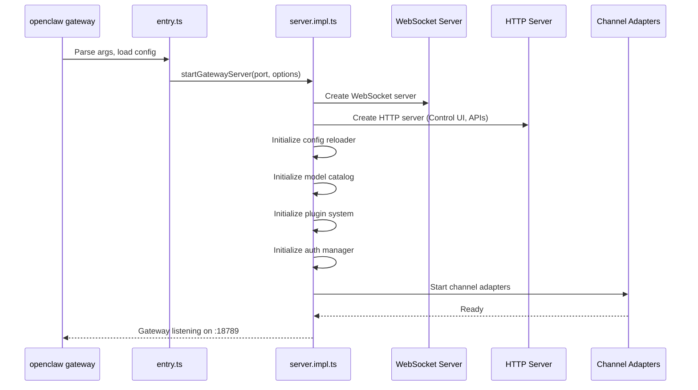
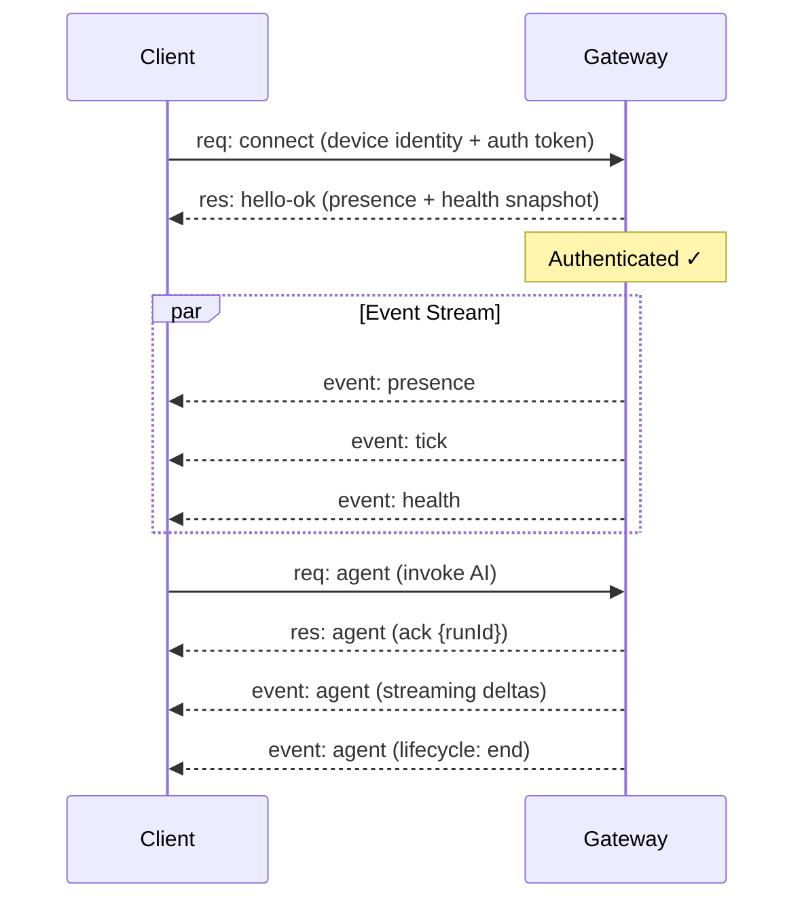

[< Back to README](./README.md) | [Prev: Architecture Overview](./01-architecture-overview.md) | [Next: Agent Loop](./03-agent-loop.md)

# Gateway & Daemon Architecture

## The Gateway: Heart of OpenClaw

The Gateway is the **central daemon** process that owns everything. It's a single long-lived process per host that manages all messaging surfaces, agent runs, configuration, and client connections.

### What the Gateway Does

1. **Maintains messaging connections** — WhatsApp, Telegram, Discord, etc.
2. **Exposes a typed WebSocket API** — RPC + server-push events
3. **Serves the Web Control UI** — HTTP server for the admin dashboard
4. **Runs the agent loop** — Invokes AI models for auto-reply
5. **Manages state** — Sessions, config, auth profiles, plugin lifecycle

### Gateway Startup Flow



### Gateway Components

```
Gateway Server (server.impl.ts)
│
├── WebSocket Server
│   ├── Connection Manager (auth, rate limiting)
│   ├── RPC Method Handlers (46 methods)
│   │   ├── agent, agent.wait
│   │   ├── chat.send, chat.abort
│   │   ├── sessions.list, sessions.reset
│   │   ├── config.get, config.patch
│   │   ├── channels.status
│   │   ├── health, status
│   │   └── ... (40+ more)
│   ├── Event Broadcaster (multicasts to clients)
│   │   ├── agent events (streaming)
│   │   ├── chat events (deltas, finals)
│   │   ├── presence events
│   │   ├── health state versioning
│   │   └── heartbeat/cron events
│   └── Node Subscriptions (mobile/companion apps)
│
├── HTTP Server
│   ├── Control UI (Lit web app)
│   ├── Canvas/A2UI Host (port 18793)
│   ├── Slack HTTP endpoints
│   ├── OpenAI-compatible API (/v1/chat/completions)
│   ├── OpenResponses API
│   ├── Hook endpoints
│   └── Avatar serving
│
├── Config Reloader (watches openclaw.json)
├── Model Catalog + Auth Manager
├── Plugin System + Hook Registry
└── Channel Manager
```

## WebSocket Protocol

The Gateway uses a custom typed protocol over WebSocket text frames:

### Frame Types

```typescript
// Request: client → gateway
{ type: "req", id: string, method: string, params: object }

// Response: gateway → client
{ type: "res", id: string, ok: boolean, payload?: any, error?: string }

// Event: gateway → client (server push)
{ type: "event", event: string, payload: any, seq?: number, stateVersion?: number }
```

### Connection Lifecycle



### Security

- First frame **must** be `connect` or hard close
- Device-based auth with tokens
- `OPENCLAW_GATEWAY_TOKEN` for gateway-level auth
- Pairing approval for new devices
- Local connections can be auto-approved
- Non-local connections require signed challenge nonce
- Rate limiting on connection and message level

## The Daemon

The daemon is the **OS service wrapper** that keeps the Gateway running in the background.

### Platform Support

| Platform | Service Manager | Config Location |
|----------|----------------|-----------------|
| macOS | launchd (LaunchAgent) | `~/Library/LaunchAgents/` |
| Linux | systemd (user service) | `~/.config/systemd/user/` |
| Windows | Task Scheduler (schtasks) | Windows Registry |

### Daemon Architecture

```
┌─────────────────────────────────────────┐
│           OS Service Manager             │
│  (launchd / systemd / Task Scheduler)   │
└────────────────┬────────────────────────┘
                 │ manages
                 ▼
┌─────────────────────────────────────────┐
│           OpenClaw Daemon                │
│                                          │
│  ┌──────────────────────────────────┐   │
│  │  service.ts - Generic abstraction │   │
│  └──────────┬───────────────────────┘   │
│             │                            │
│  ┌──────────┴───────────────────────┐   │
│  │  Platform-specific managers:      │   │
│  │  ├── launchd.ts (macOS)          │   │
│  │  │   - plist generation          │   │
│  │  │   - LaunchAgent management    │   │
│  │  ├── systemd.ts (Linux)          │   │
│  │  │   - Unit file generation      │   │
│  │  │   - Linger state management   │   │
│  │  └── schtasks.ts (Windows)       │   │
│  │      - Task Registry management  │   │
│  └──────────────────────────────────┘   │
│                                          │
│  ┌──────────────────────────────────┐   │
│  │  service-env.ts                   │   │
│  │  - Environment variable setup     │   │
│  │  - PATH, API keys, config paths  │   │
│  └──────────────────────────────────┘   │
│                                          │
│  ┌──────────────────────────────────┐   │
│  │  service-audit.ts                 │   │
│  │  - Health verification            │   │
│  │  - Config validation              │   │
│  └──────────────────────────────────┘   │
└─────────────────────────────────────────┘
```

### Daemon Commands

```bash
openclaw daemon start    # Install and start the service
openclaw daemon stop     # Stop the service
openclaw daemon restart  # Restart the service
openclaw daemon status   # Check service status
openclaw daemon logs     # View daemon logs
```

## Web Control UI

The Web UI is a **Lit Web Components** application served by the Gateway's HTTP server.

### Architecture

```
ui/
├── src/
│   ├── main.ts                    # Entry point
│   ├── ui/
│   │   ├── app.ts                 # Main LitElement app
│   │   ├── app-render.ts          # 42KB rendering logic
│   │   ├── gateway.ts             # WebSocket client (GatewayBrowserClient)
│   │   ├── controllers/           # Reactive controllers
│   │   │   ├── assistant-identity # Agent identity management
│   │   │   ├── device-pairing     # Device pairing flows
│   │   │   ├── exec-approval      # Tool execution approval
│   │   │   ├── skills             # Skills management
│   │   │   └── sessions           # Session handling
│   │   └── views/                 # 50+ view components
│   │       ├── chat               # Real-time chat interface
│   │       ├── channels           # Channel configuration
│   │       ├── sessions           # Session list/management
│   │       ├── overview           # Dashboard
│   │       ├── usage              # Usage metrics
│   │       └── agent-config       # Agent settings
│   └── styles/                    # CSS styles
└── public/                         # Static assets
```

### How the Web UI Connects

1. Browser loads the Lit app from Gateway's HTTP server
2. `GatewayBrowserClient` opens a WebSocket connection to Gateway
3. Authenticates via device identity + token
4. Receives real-time events (chat deltas, presence, health)
5. Sends RPC requests (send messages, manage sessions, configure)

### Key Features

- Real-time chat interface with streaming responses
- Channel status monitoring
- Session management and history
- Agent configuration
- Usage metrics and tracking
- Device pairing workflow
- Tool execution approval UI
