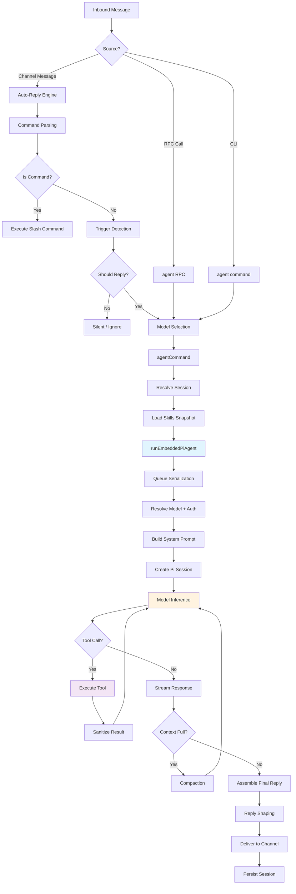
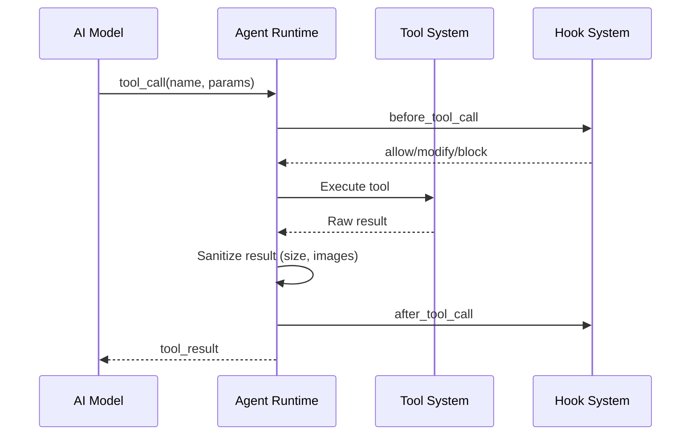
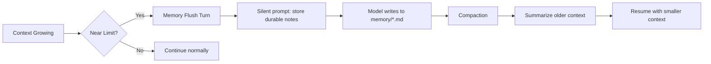

[< Back to README](./README.md) | [Prev: Gateway & Daemon](./02-gateway-and-daemon.md) | [Next: Model Providers](./04-model-providers-and-calling.md)

# Agent Loop: How OpenClaw Runs AI

## What is the Agent Loop?

The agent loop is the full agentic run: **intake → context assembly → model inference → tool execution → streaming replies → persistence**. It's the core engine that turns an inbound message into AI-powered actions and a final reply.

## Entry Points

Two ways to trigger the agent loop:

1. **Gateway RPC**: `agent` and `agent.wait` methods (from any WebSocket client)
2. **CLI**: `openclaw agent` command (direct invocation)
3. **Auto-reply**: Inbound message from a messaging channel triggers the loop automatically

## The Complete Agent Loop Flow



## Detailed Walkthrough

### Phase 1: Message Intake

```
Channel Adapter (WhatsApp/Telegram/...)
        │
        ▼
Auto-Reply Engine (src/auto-reply/)
        │
        ├── Message Normalization
        ├── Media Processing (images, audio, video)
        ├── Command Detection (/new, /model, /stop, etc.)
        ├── Trigger Evaluation (mentions, DM policy, groups)
        └── Templating (variable interpolation)
```

### Phase 2: Agent Invocation

```typescript
// Simplified flow from the source code
async function agentCommand(params) {
  // 1. Validate params and resolve session
  const session = resolveSession(sessionKey, sessionId);

  // 2. Resolve model + thinking/verbose defaults
  const model = resolveModel(config);

  // 3. Load skills snapshot
  const skills = await loadWorkspaceSkillSnapshot(workspace);

  // 4. Run the embedded pi-agent
  const result = await runEmbeddedPiAgent({
    session,
    model,
    skills,
    prompt,
    images,
    timeout,
  });

  // 5. Emit lifecycle end/error
  emit("lifecycle", { phase: "end", result });
}
```

### Phase 3: Pi-Agent-Core Execution

OpenClaw wraps the `@mariozechner/pi-agent-core` SDK to run the actual model inference:

```
runEmbeddedPiAgent()
        │
        ├── 1. Serialize via per-session + global queue
        │      (prevents concurrent runs on same session)
        │
        ├── 2. Resolve model + auth profile
        │      (primary → fallbacks → provider rotation)
        │
        ├── 3. Build system prompt
        │      (OpenClaw-owned, not pi default)
        │
        ├── 4. Create pi session
        │      createAgentSession() from pi-coding-agent
        │
        ├── 5. Subscribe to pi events
        │      subscribeEmbeddedPiSession()
        │      - tool events → stream: "tool"
        │      - assistant deltas → stream: "assistant"
        │      - lifecycle → stream: "lifecycle"
        │
        ├── 6. Execute prompt
        │      activeSession.prompt(effectivePrompt, { images })
        │
        ├── 7. Enforce timeout
        │      Default 600s, abort if exceeded
        │
        └── 8. Return payloads + usage metadata
```

### Phase 4: Tool Execution

When the model calls a tool:



### Phase 5: Response Delivery

```
Agent Output
    │
    ├── Reply Shaping
    │   ├── Assemble text + optional reasoning
    │   ├── Inline tool summaries (when verbose)
    │   ├── NO_REPLY filtering (silent tokens)
    │   └── Messaging tool duplicate removal
    │
    ├── Block Streaming
    │   ├── Partial replies on text_end or message_end
    │   └── Reasoning streaming (separate or block)
    │
    └── Channel Delivery
        ├── Format for target platform
        ├── Split long messages
        ├── Attach media
        └── Send via channel adapter
```

## Queueing & Concurrency

```
┌─────────────────────────────────────────┐
│          Queue System                    │
│                                          │
│  Per-Session Lane                        │
│  ┌──────┐ ┌──────┐ ┌──────┐            │
│  │ Run 1│→│ Run 2│→│ Run 3│  (serial)  │
│  └──────┘ └──────┘ └──────┘            │
│                                          │
│  Global Lane (optional)                  │
│  ┌──────┐ ┌──────┐                      │
│  │ Run A│→│ Run B│  (serial)            │
│  └──────┘ └──────┘                      │
│                                          │
│  Queue Modes:                            │
│  - collect: batch messages               │
│  - steer: route to correct agent         │
│  - followup: chain related messages      │
└─────────────────────────────────────────┘
```

## Hook Points (Extension Points)

The agent loop exposes hooks at every stage:

| Hook | When | Use Case |
|------|------|----------|
| `agent:bootstrap` | Before system prompt assembly | Add/swap bootstrap files |
| `before_agent_start` | Before run starts | Inject context, override prompts |
| `agent_end` | After completion | Inspect final messages, metadata |
| `before_tool_call` | Before tool execution | Intercept, modify, block tools |
| `after_tool_call` | After tool result | Transform results |
| `tool_result_persist` | Before writing to session | Sanitize tool results |
| `before_compaction` | Before context compaction | Observe, annotate |
| `after_compaction` | After compaction | React to compacted context |
| `message_received` | Inbound message | Pre-process, filter |
| `message_sending` | Before sending reply | Modify outgoing message |
| `message_sent` | After sending reply | Log, trigger followups |
| `session_start` | Session begins | Initialize state |
| `session_end` | Session ends | Cleanup, persist |

## Compaction & Memory Flush

When the context window fills up:



## Timeouts

| Timer | Default | Description |
|-------|---------|-------------|
| Agent runtime | 600s | Max time for a single agent run |
| `agent.wait` | 30s | Max time for waiting on run completion |
| AbortSignal | N/A | External cancellation |
| Gateway disconnect | N/A | Client disconnect |
