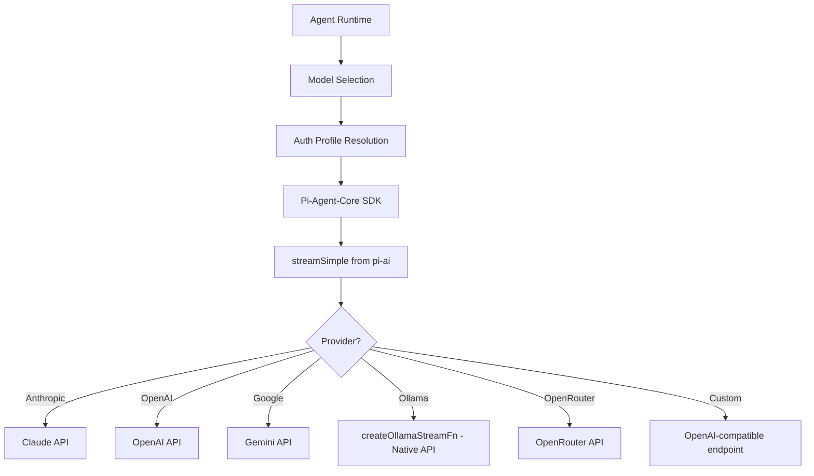
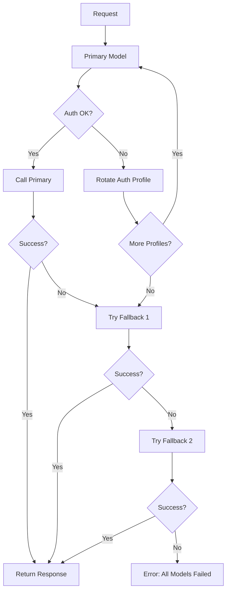

[< Back to README](./README.md) | [Prev: Agent Loop](./03-agent-loop.md) | [Next: Skills & MCP](./05-skills-and-mcp.md)

# Model Providers & How OpenClaw Calls AI Models

## Multi-Model Architecture

OpenClaw is **model-agnostic**. It doesn't hardcode any specific AI provider — instead, it uses a layered model selection + failover system that can route between Claude, GPT, Gemini, and dozens of other providers.

## How Models Are Called

### The Call Chain



### The Pi-Agent Stack

OpenClaw uses the **pi-agent** family of packages (by @mariozechner) as its AI runtime:

```
┌──────────────────────────────────────┐
│  OpenClaw Agent Runtime               │
│  (src/agents/)                        │
│                                        │
│  ┌──────────────────────────────────┐ │
│  │  @mariozechner/pi-coding-agent    │ │
│  │  - createAgentSession()           │ │
│  │  - Tool definitions               │ │
│  │  - Session management             │ │
│  └──────────┬───────────────────────┘ │
│             │                          │
│  ┌──────────┴───────────────────────┐ │
│  │  @mariozechner/pi-agent-core      │ │
│  │  - Agent loop orchestration       │ │
│  │  - Tool call/result cycle         │ │
│  │  - Event subscription             │ │
│  └──────────┬───────────────────────┘ │
│             │                          │
│  ┌──────────┴───────────────────────┐ │
│  │  @mariozechner/pi-ai              │ │
│  │  - streamSimple()                 │ │
│  │  - Model API abstraction          │ │
│  │  - Streaming protocol             │ │
│  └──────────────────────────────────┘ │
└──────────────────────────────────────┘
```

### Step-by-Step: How a Model Call Happens

```typescript
// 1. Model Selection (model-selection.ts)
// Order of precedence:
//   primary → fallbacks → provider auth failover → image model fallback

// 2. Auth Resolution (model-auth.ts)
// - OAuth vs API key
// - Auth profile rotation
// - Per-agent auth profiles

// 3. Session Creation (pi-embedded-runner/run/attempt.ts)
const session = createAgentSession({
  model: modelSpec,        // provider, API details
  tools: openclawTools,     // custom + SDK tools
  systemPrompt: prompt,     // OpenClaw-built system prompt
  streamFn: streamSimple,   // from pi-ai (or custom for Ollama)
});

// 4. Prompt Execution
const result = await session.prompt(effectivePrompt, { images });

// 5. Event Subscription
subscribeEmbeddedPiSession(session, {
  onToolEvent: (e) => emit("stream:tool", e),
  onAssistantDelta: (d) => emit("stream:assistant", d),
  onLifecycle: (l) => emit("stream:lifecycle", l),
});
```

## Supported Providers

### Tier 1 (Primary)

| Provider | Models | Auth Method |
|----------|--------|-------------|
| **Anthropic** | claude-opus-4-6, claude-sonnet-4-5 | API key, Claude CLI setup-token |
| **OpenAI** | GPT-4o, GPT-5, o1, o3 | API key, Codex OAuth |
| **Google** | Gemini 2.5 Pro/Flash | API key, OAuth |

### Tier 2 (Supported)

| Provider | Notes |
|----------|-------|
| Ollama | Local models, custom stream function |
| OpenRouter | Access to 100+ models, free tier |
| AWS Bedrock | Enterprise Claude/Titan |
| GitHub Copilot | Via copilot-proxy extension |
| QianFan | Baidu models |
| Minimax | Via portal auth |
| Kimi | Moonshot models |
| Z.AI | Various models |

## Model Selection & Failover



### Configuration

```json5
{
  agents: {
    defaults: {
      model: {
        primary: "anthropic/claude-sonnet-4-5",
        fallbacks: [
          "openai/gpt-4o",
          "google/gemini-2.5-flash"
        ]
      },
      imageModel: {
        primary: "anthropic/claude-sonnet-4-5",
        fallbacks: ["openai/gpt-4o"]
      },
      models: {
        "anthropic/claude-sonnet-4-5": { alias: "Sonnet" },
        "anthropic/claude-opus-4-6": { alias: "Opus" },
        "openai/gpt-4o": { alias: "GPT-4o" },
      }
    }
  }
}
```

## Tool Schema Adaptation

Different models need different tool schema formats. OpenClaw handles this:

```
Tool Definitions (OpenClaw native)
        │
        ├── Claude: Parameter groups (Anthropic-specific)
        ├── OpenAI: Standard function calling
        ├── Google: Cleaned schemas (no unsupported fields)
        └── Ollama: Simplified tool format
```

## Extended Thinking / Reasoning

OpenClaw supports reasoning levels that map to model-specific thinking features:

| Level | Behavior |
|-------|----------|
| `off` | No thinking/reasoning |
| `minimal` | Lightweight reasoning |
| `low` | Some chain-of-thought |
| `medium` | Moderate reasoning |
| `high` | Extended thinking |
| `xhigh` | Maximum reasoning depth |

## Cache Support

- **Anthropic**: Prompt caching via `createCacheTrace()`
- Cache TTL tracking for eligible providers
- System prompt designed for cache stability (timezone only, no dynamic clock)

## Streaming

Model responses are streamed in real-time:

```
Model API → pi-ai streamSimple() → pi-agent-core events
    → subscribeEmbeddedPiSession() → OpenClaw event stream
        → WebSocket → Client UI / Channel Delivery
```

Stream event types:
- `assistant` — Text deltas from the model
- `tool` — Tool start/update/end events
- `lifecycle` — Phase transitions (start → end/error)
