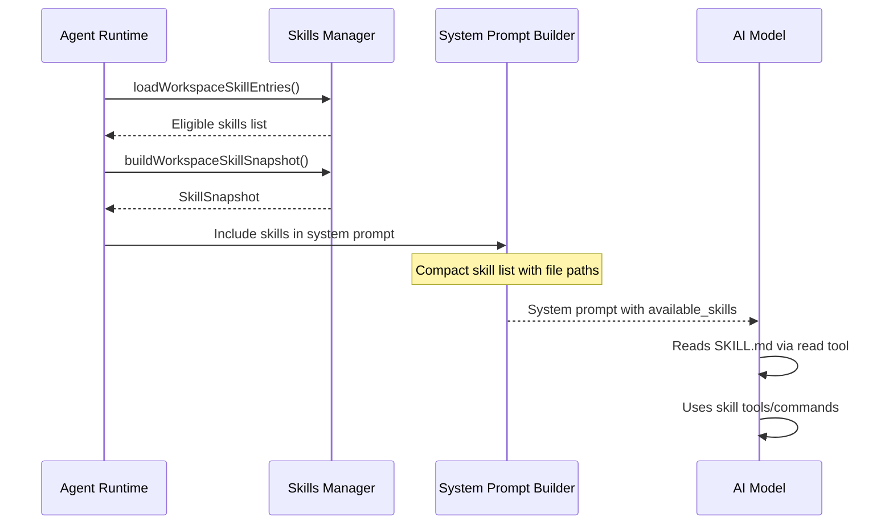
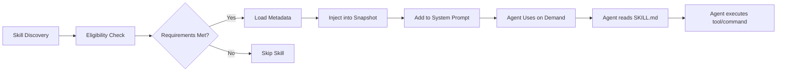

[< Back to README](./README.md) | [Prev: Model Providers](./04-model-providers-and-calling.md) | [Next: Soul & Persona](./06-soul-persona-system-prompt.md)

# Skills System & MCP Integration

## Skills: What Are They?

Skills are **modular capabilities** that an agent can load on-demand. Each skill is a self-contained package with instructions, tool requirements, and environment configuration. Think of them as "plugins for the AI's brain."

## Skills Architecture

```
┌─────────────────────────────────────────────┐
│              Skills System                   │
│                                              │
│  ┌──────────────────────────────────────┐   │
│  │     Skill Discovery + Loading         │   │
│  │  loadWorkspaceSkillEntries()          │   │
│  │  buildWorkspaceSkillSnapshot()        │   │
│  └──────────────┬───────────────────────┘   │
│                 │                             │
│  ┌──────────────┴───────────────────────┐   │
│  │     Skill Sources (3 locations)       │   │
│  │                                       │   │
│  │  1. Bundled Skills (skills/)          │   │
│  │     └── 55+ built-in skills          │   │
│  │                                       │   │
│  │  2. Managed Skills (~/.openclaw/)     │   │
│  │     └── Downloaded/installed skills  │   │
│  │                                       │   │
│  │  3. Workspace Skills (workspace/)     │   │
│  │     └── Project-specific skills      │   │
│  └──────────────┬───────────────────────┘   │
│                 │                             │
│  ┌──────────────┴───────────────────────┐   │
│  │     Skill Injection                   │   │
│  │                                       │   │
│  │  → System Prompt: skill list + paths │   │
│  │  → Environment: injected env vars    │   │
│  │  → Tools: registered commands        │   │
│  └──────────────────────────────────────┘   │
└─────────────────────────────────────────────┘
```

## Anatomy of a Skill

Each skill lives in its own directory with a `SKILL.md` manifest:

```
skills/github/
├── SKILL.md          # Manifest: name, description, install, usage
├── install.sh        # (optional) Installation script
└── config.json       # (optional) Configuration schema
```

### SKILL.md Structure

```markdown
---
name: "GitHub"
description: "Interact with GitHub repos, issues, and PRs"
emoji: 🐙
install:
  type: "brew"
  package: "gh"
requirements:
  - binary: "gh"
commands:
  - name: "/github"
    description: "Run GitHub commands"
---

# GitHub Skill

Instructions for the agent on how to use this skill...
```

### Skill Types

| Type | Description | Example |
|------|-------------|---------|
| `SkillEntry` | Individual skill with metadata | GitHub, Notion, Slack |
| `SkillSnapshot` | All available skills for a run | Computed per-agent-run |
| `SkillCommandSpec` | User-invocable commands | `/github`, `/weather` |
| `SkillInvocationPolicy` | Who can invoke | user-only, model-ok |

### Installation Types

| Type | How | Example |
|------|-----|---------|
| `brew` | Homebrew | `gh`, `jq` |
| `node` | npm/pnpm | `@package/name` |
| `go` | go install | `github.com/...` |
| `uv` | Python uv | `package-name` |
| `download` | Direct download | Binary URL |

## How Skills Are Used at Runtime



### Skills in the System Prompt

The system prompt includes a compact skill list:

```xml
<available_skills>
  <skill>
    <name>GitHub</name>
    <description>Interact with GitHub repos, issues, PRs</description>
    <location>/path/to/skills/github/SKILL.md</location>
  </skill>
  <skill>
    <name>Weather</name>
    <description>Get weather forecasts</description>
    <location>/path/to/skills/weather/SKILL.md</location>
  </skill>
</available_skills>
```

The model is instructed to `read` the SKILL.md at the listed path when it needs the skill. This keeps the base prompt small.

## Bundled Skills (55+)

### Categories

**AI & Content**
- `coding-agent` — Coding assistance
- `gemini` — Gemini integration
- `openai-image-gen` — Image generation
- `openai-whisper` — Speech-to-text
- `canvas` — Canvas rendering

**Productivity**
- `apple-notes`, `bear-notes`, `obsidian` — Note taking
- `notion`, `trello` — Project management
- `apple-reminders` — Reminders
- `1password` — Password management

**Communication**
- `github` — GitHub integration
- `discord`, `slack` — Messaging
- `himalaya` — Email client
- `imsg`, `bluebubbles` — iMessage

**Media**
- `spotify-player` — Spotify control
- `video-frames` — Video processing
- `gifgrep` — GIF search
- `songsee` — Song identification
- `peekaboo` — Camera access

**Smart Home**
- `openhue` — Philips Hue
- `sonoscli` — Sonos speakers
- `eightctl` — Eight Sleep

**System**
- `tmux` — Terminal multiplexer
- `camsnap` — Camera snapshots
- `mcporter` — MCP server manager

**Meta**
- `skill-creator` — Generate new skills
- `healthcheck` — Health monitoring
- `model-usage` — Usage tracking

## MCP (Model Context Protocol) Integration

### How MCP Works in OpenClaw

OpenClaw integrates MCP through the **mcporter skill** — a CLI tool for managing MCP servers and calling MCP tools:

```
┌─────────────────────────────────────────────┐
│              OpenClaw Agent                   │
│                                              │
│  ┌────────────────────────────────────┐     │
│  │  mcporter Skill                     │     │
│  │                                     │     │
│  │  mcporter list                      │     │
│  │  mcporter list <server> --schema    │     │
│  │  mcporter call <server.tool> k=v    │     │
│  │  mcporter auth <server>             │     │
│  │  mcporter config list|get|add       │     │
│  └──────────────┬─────────────────────┘     │
│                 │                             │
│  ┌──────────────┴─────────────────────┐     │
│  │  MCP Server Interface               │     │
│  │                                     │     │
│  │  ┌─────────┐ ┌─────────┐ ┌──────┐ │     │
│  │  │HTTP MCP │ │stdio MCP│ │Ad-hoc│ │     │
│  │  │servers  │ │servers  │ │server│ │     │
│  │  └─────────┘ └─────────┘ └──────┘ │     │
│  └─────────────────────────────────────┘     │
└─────────────────────────────────────────────┘
```

### MCP Commands

```bash
# List available MCP servers
mcporter list

# List tools from a specific server
mcporter list <server> --schema

# Call an MCP tool
mcporter call <server.tool> key=value

# Authenticate with an MCP server
mcporter auth <server>

# Manage MCP config
mcporter config list
mcporter config add <server>
mcporter config remove <server>
mcporter config import
```

### MCP vs Native Skills

| Aspect | Native Skills | MCP (via mcporter) |
|--------|--------------|-------------------|
| Discovery | SKILL.md in skills/ | mcporter list |
| Invocation | Direct tool/command | mcporter call |
| Installation | brew/npm/go/uv | mcporter config add |
| Auth | Env vars | mcporter auth |
| Performance | Native, fast | IPC overhead |
| Flexibility | OpenClaw-specific | Standard protocol |

### When to Use MCP vs Skills

- **Use Skills when**: You need deep OpenClaw integration, environment injection, custom commands, or the capability is OpenClaw-specific.
- **Use MCP when**: You want to connect to a standard MCP server, share tools across different AI frameworks, or use third-party MCP-compatible services.

## Skill Lifecycle



### Eligibility Context

Skills can have requirements:
- **OS**: macOS, Linux, Windows
- **Binary**: Specific CLI tools must be installed
- **Environment**: Specific env vars must be set
- **Platform**: Specific runtime capabilities
