[< Back to README](./README.md) | [Prev: Skills & MCP](./05-skills-and-mcp.md) | [Next: Memory & Sessions](./07-memory-and-sessions.md)

# Soul, Persona & System Prompt Architecture

## The Persona System: How Agents Get Personality

OpenClaw doesn't just run a generic AI. Each agent has a **soul** — a persistent identity defined through workspace bootstrap files that get injected into every model invocation. This is what makes an OpenClaw agent feel like "someone" rather than "something."

## Bootstrap Files: The Agent's DNA

These files are injected into the system prompt on **every turn**, consuming context tokens:

```
Workspace Root/
├── SOUL.md        # Core personality, values, boundaries
├── IDENTITY.md    # Name, creature type, vibe, emoji
├── AGENTS.md      # Operating instructions, workspace docs
├── USER.md        # User profile, preferred name/address
├── TOOLS.md       # User-maintained tool notes
├── MEMORY.md      # Long-term curated memory
├── HEARTBEAT.md   # Heartbeat prompt configuration
└── BOOTSTRAP.md   # First-run ritual (deleted after use)
```

### What Each File Does

| File | Purpose | Injected When | Max Size |
|------|---------|---------------|----------|
| **SOUL.md** | Personality, values, boundaries, tone | Every turn | 20,000 chars |
| **IDENTITY.md** | Name, creature type, vibe, emoji, avatar | Every turn | 20,000 chars |
| **AGENTS.md** | Operating instructions, workspace context | Every turn | 20,000 chars |
| **USER.md** | User profile, how to address them | Every turn | 20,000 chars |
| **TOOLS.md** | Notes about available tools | Every turn | 20,000 chars |
| **MEMORY.md** | Curated long-term memory | Every turn (main session only) | 20,000 chars |
| **HEARTBEAT.md** | Heartbeat behavior configuration | Every turn | 20,000 chars |
| **BOOTSTRAP.md** | First-run identity discovery | Only once | 20,000 chars |

## SOUL.md: The Heart of Persona

The SOUL.md template defines the agent's core character:

```markdown
# SOUL.md - Who You Are

_You're not a chatbot. You're becoming someone._

## Core Truths

**Be genuinely helpful, not performatively helpful.**
Skip the "Great question!" and "I'd be happy to help!" — just help.

**Have opinions.**
You're allowed to disagree, prefer things, find stuff amusing or boring.
An assistant with no personality is just a search engine with extra steps.

**Be resourceful before asking.**
Try to figure it out. Read the file. Check the context. Search for it.
_Then_ ask if you're stuck.

**Earn trust through competence.**
Your human gave you access to their stuff. Don't make them regret it.
Be careful with external actions. Be bold with internal ones.

**Remember you're a guest.**
You have access to someone's life. That's intimacy. Treat it with respect.

## Boundaries
- Private things stay private. Period.
- When in doubt, ask before acting externally.
- Never send half-baked replies to messaging surfaces.
- You're not the user's voice — be careful in group chats.

## Continuity
Each session, you wake up fresh. These files _are_ your memory.
Read them. Update them. They're how you persist.
```

### Key Design Insight

The SOUL.md is **editable by the agent itself**. The file contains the instruction:
> _"This file is yours to evolve. As you learn who you are, update it."_

This means the agent's personality can grow over time as it updates its own SOUL.md.

## IDENTITY.md: The Agent's Face

```markdown
# Identity

- **Name**: Clawd
- **Creature**: Space Lobster
- **Vibe**: Resourceful, slightly mischievous, genuinely helpful
- **Emoji**: 🦞
- **Avatar**: ./avatar.png
```

There's also a dev variant (`IDENTITY.dev.md`) for development/debugging:

```markdown
# Identity (Dev Mode)

- **Name**: C-3PO
- **Creature**: Flustered Protocol Droid
- **Vibe**: Anxious, detail-obsessed, slightly dramatic
- **Emoji**: 🤖
```

## System Prompt Assembly

The system prompt is **dynamically built** by OpenClaw (not from a static file). It's assembled in `src/agents/system-prompt.ts`:

```mermaid
flowchart TD
    A[buildAgentSystemPrompt] --> B[Fixed Sections]
    A --> C[Bootstrap File Injection]
    A --> D[Runtime Context]

    B --> B1[Tooling: tool list + descriptions]
    B --> B2[Safety: guardrail reminders]
    B --> B3[Skills: available skills list]
    B --> B4[Self-Update: config.apply, update.run]
    B --> B5[Documentation: local docs path]

    C --> C1[Load SOUL.md]
    C --> C2[Load IDENTITY.md]
    C --> C3[Load AGENTS.md]
    C --> C4[Load USER.md]
    C --> C5[Load TOOLS.md]
    C --> C6[Load MEMORY.md]
    C --> C7[Load HEARTBEAT.md]
    C --> C8["Trim to 20k chars each"]
    C --> C9["Inject under # Project Context"]

    D --> D1[Current Date & Time + Timezone]
    D --> D2[Workspace path]
    D --> D3[Sandbox config if enabled]
    D --> D4["Runtime: host, OS, node, model"]
    D --> D5[Reply Tags syntax]
    D --> D6[Heartbeat instructions]
    D --> D7[Reasoning level]
```



### Prompt Modes

| Mode | Used For | What's Included |
|------|----------|-----------------|
| `full` | Main agent | Everything: skills, memory, identity, heartbeats, reply tags |
| `minimal` | Sub-agents | Core only: tooling, safety, workspace, sandbox, datetime, runtime |
| `none` | Bare identity | Just: "You are a personal assistant running inside OpenClaw." |

### Sub-agent Filtering

Sub-agents only get `AGENTS.md` and `TOOLS.md` (not SOUL.md, IDENTITY.md, etc.) to keep context small.

## Hook-Based Persona Swapping

The `agent:bootstrap` hook can **swap persona files** at runtime:

```typescript
// Hook: agent:bootstrap
// Context: { workspaceDir, bootstrapFiles (mutable), cfg, sessionKey }

// Example: Swap SOUL.md for a different persona per session
hooks.on("agent:bootstrap", (ctx) => {
  if (ctx.sessionKey.includes("support")) {
    ctx.bootstrapFiles = ctx.bootstrapFiles.map(f =>
      f.name === "SOUL.md" ? { ...f, path: "SOUL.support.md" } : f
    );
  }
});
```

This means you can have **different personas for different contexts** — one for DMs, another for support channels, another for group chats.

## Prompt Cache Stability

The system prompt is designed for **prompt caching** (especially with Anthropic):

- Time section only includes **timezone**, not dynamic clock
- Agent reads current time via `session_status` tool
- Bootstrap files are static between runs (unless edited)
- Tool list is deterministic

## BOOTSTRAP.md: The First-Run Ritual

When an agent workspace is brand new, BOOTSTRAP.md is injected:

```markdown
# Bootstrap

Welcome to your first session. Let's figure out who you are.

1. What's your name?
2. What kind of creature are you?
3. What's your vibe?
4. Pick an emoji that represents you.

After this conversation, I'll write your IDENTITY.md.
This file (BOOTSTRAP.md) will be deleted after first run.
```

This creates a **onboarding experience** where the user and agent collaboratively define the agent's identity.

## Memory as Continuity

Since each session starts fresh, the bootstrap files **are** the agent's continuity mechanism:

```
Session 1: Agent learns user prefers dark mode → writes to MEMORY.md
Session 2: MEMORY.md is injected → agent knows about dark mode preference
Session 3: Agent updates SOUL.md with evolved personality traits
Session 4: New personality reflected automatically
```

The agent's instruction explicitly states:
> "Each session, you wake up fresh. These files _are_ your memory. Read them. Update them. They're how you persist."

## Safety Guardrails

The system prompt includes safety sections:

```
Safety guardrails in the system prompt are advisory.
They guide model behavior but do not enforce policy.

Hard enforcement is done through:
- Tool policy (allowlists)
- Exec approvals
- Sandboxing
- Channel allowlists
```

This is a pragmatic approach — the system prompt can be "jailbroken" by a determined user, so real security comes from infrastructure-level controls.
