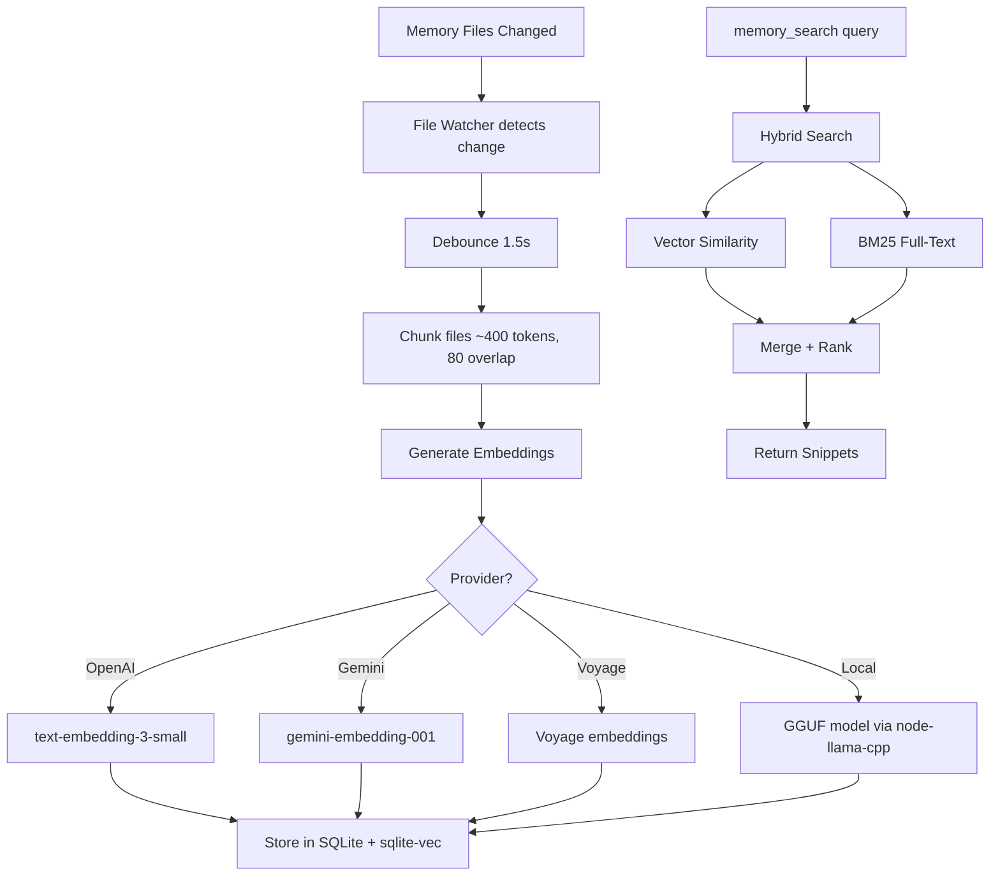
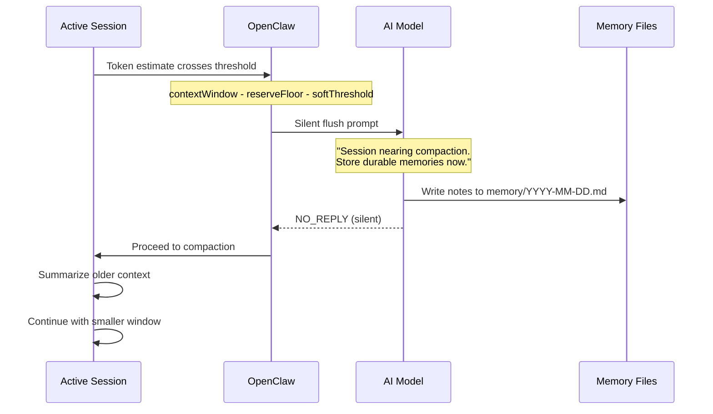
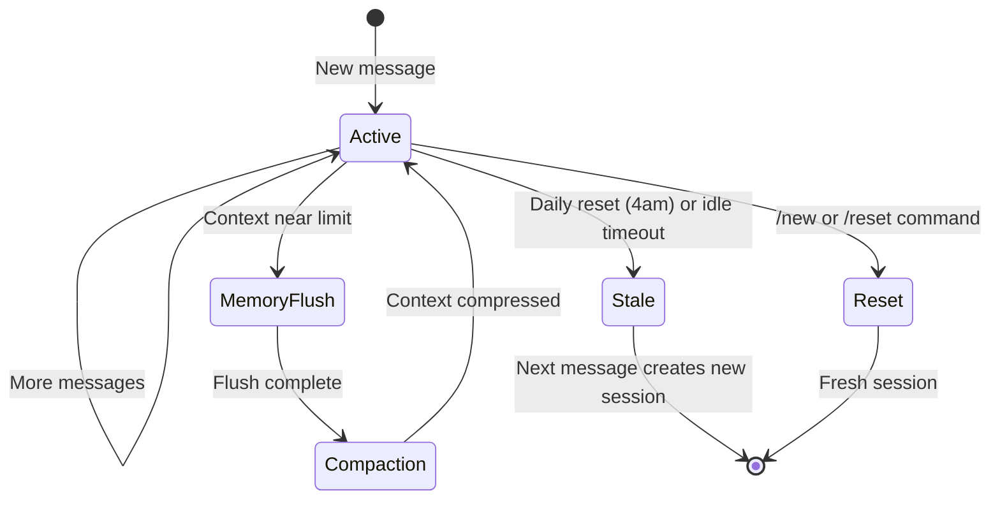

[< Back to README](./README.md) | [Prev: Soul & Persona](./06-soul-persona-system-prompt.md) | [Next: Plugins & Extensions](./08-plugin-and-extension-system.md)

# Memory System & Session Management

## Memory: How Agents Remember

OpenClaw memory is **plain Markdown files on disk**. The model only "remembers" what gets written to these files. There's no magic — it's files all the way down.

## Memory Architecture

```
┌──────────────────────────────────────────────────┐
│                Memory System                      │
│                                                    │
│  ┌─────────────────────────────────────────────┐  │
│  │  Layer 1: Bootstrap Injection (per turn)     │  │
│  │  MEMORY.md → injected into system prompt     │  │
│  │  (Only in main/private session)              │  │
│  └─────────────────────────────────────────────┘  │
│                                                    │
│  ┌─────────────────────────────────────────────┐  │
│  │  Layer 2: Daily Logs                         │  │
│  │  memory/YYYY-MM-DD.md → append-only logs     │  │
│  │  Read today + yesterday at session start     │  │
│  └─────────────────────────────────────────────┘  │
│                                                    │
│  ┌─────────────────────────────────────────────┐  │
│  │  Layer 3: Vector Search (on-demand)          │  │
│  │  SQLite + sqlite-vec index over all memory   │  │
│  │  memory_search / memory_get tools            │  │
│  └─────────────────────────────────────────────┘  │
│                                                    │
│  ┌─────────────────────────────────────────────┐  │
│  │  Layer 4: QMD Backend (experimental)         │  │
│  │  BM25 + vectors + reranking sidecar          │  │
│  │  Local-first via Bun + node-llama-cpp        │  │
│  └─────────────────────────────────────────────┘  │
└──────────────────────────────────────────────────┘
```

## Memory File Layout

```
~/.openclaw/workspace/
├── MEMORY.md                  # Curated long-term memory
│                               # (injected every turn in main session)
├── memory/
│   ├── 2026-02-14.md          # Today's daily log
│   ├── 2026-02-13.md          # Yesterday's log
│   ├── 2026-02-12.md          # Older logs (searchable, not injected)
│   └── ...
└── ...
```

## Vector Memory Search

### How It Works



### Hybrid Search (BM25 + Vector)

OpenClaw combines two retrieval signals:

| Signal | Good At | Weak At |
|--------|---------|---------|
| **Vector** | Paraphrases, semantic similarity | Exact tokens, IDs, code symbols |
| **BM25** | Exact tokens, keywords | Paraphrases, synonyms |

Formula:
```
finalScore = vectorWeight * vectorScore + textWeight * textScore
```
Default: 70% vector, 30% BM25.

### Embedding Provider Fallback

```
1. local (if GGUF model configured)
2. openai (if API key available)
3. gemini (if API key available)
4. voyage (if API key available)
5. disabled (no provider found)
```

### Tools

| Tool | Purpose |
|------|---------|
| `memory_search` | Semantic search across all memory markdown |
| `memory_get` | Read specific memory file content |

## Auto-Compaction Memory Flush

Before the context window fills up and compaction happens, OpenClaw runs a **silent memory flush turn**:



## Session Management

### Session Keys

```
Direct Messages:
  agent:<agentId>:main              (dmScope: "main" — default)
  agent:<agentId>:dm:<peerId>       (dmScope: "per-peer")
  agent:<agentId>:<ch>:dm:<peerId>  (dmScope: "per-channel-peer")

Groups:
  agent:<agentId>:<channel>:group:<id>

Channels:
  agent:<agentId>:<channel>:channel:<id>

Special:
  cron:<job.id>           (cron jobs)
  hook:<uuid>             (webhooks)
  node-<nodeId>           (node runs)
```

### Session Storage

```
~/.openclaw/agents/<agentId>/sessions/
├── sessions.json              # Session store (key → metadata)
└── <SessionId>.jsonl          # Session transcript (append-only)
```

### Session Lifecycle



### Session Reset Modes

| Mode | Behavior |
|------|----------|
| `daily` | Reset at configured hour (default 4am) |
| `idle` | Reset after N minutes of inactivity |
| `daily + idle` | Whichever expires first |

### DM Scope (Multi-User Security)

```
Without dmScope (default "main"):
  Alice → Agent → Shared session ← Bob
  ⚠️ Bob can see Alice's context!

With dmScope: "per-channel-peer":
  Alice → Agent → Session A (isolated)
  Bob → Agent → Session B (isolated)
  ✅ Each user gets their own context
```

### Session Pruning

OpenClaw trims **old tool results** from in-memory context before LLM calls:
- Does NOT rewrite JSONL history
- Only affects what the model "sees"
- Keeps session transcripts intact for debugging

## State Directory Structure

```
~/.openclaw/
├── openclaw.json                    # Main configuration
├── workspace/                       # Default agent workspace
│   ├── SOUL.md
│   ├── IDENTITY.md
│   ├── AGENTS.md
│   ├── USER.md
│   ├── MEMORY.md
│   └── memory/
│       └── YYYY-MM-DD.md
├── agents/
│   └── <agentId>/
│       ├── sessions/
│       │   ├── sessions.json        # Session store
│       │   └── *.jsonl              # Transcripts
│       ├── auth-profiles.json       # Per-agent auth
│       ├── models.json              # Custom model registry
│       └── qmd/                     # QMD sidecar state
│           ├── xdg-config/
│           └── xdg-cache/
├── memory/
│   └── <agentId>.sqlite             # Vector search index
├── settings/
│   └── tts.json                     # TTS preferences
└── logs/
```
