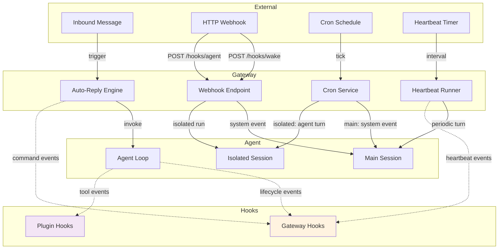
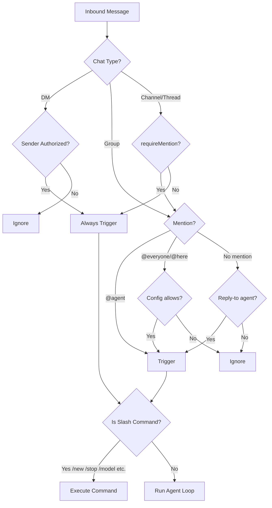
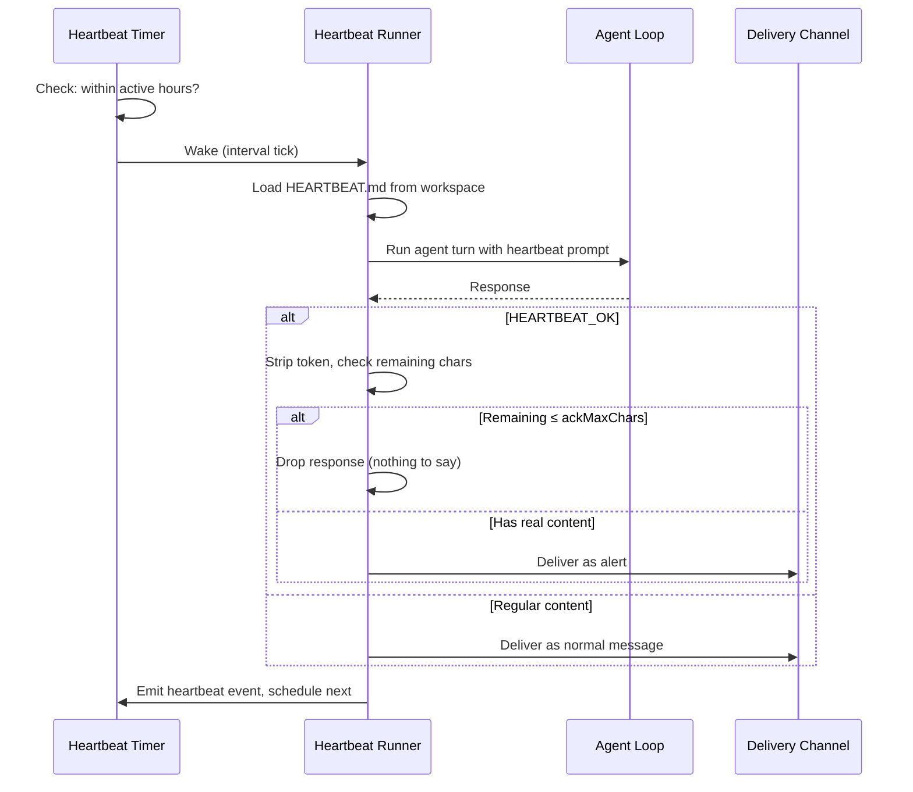
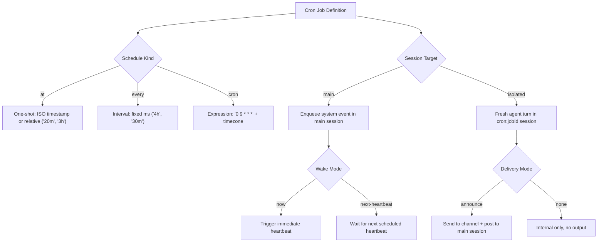
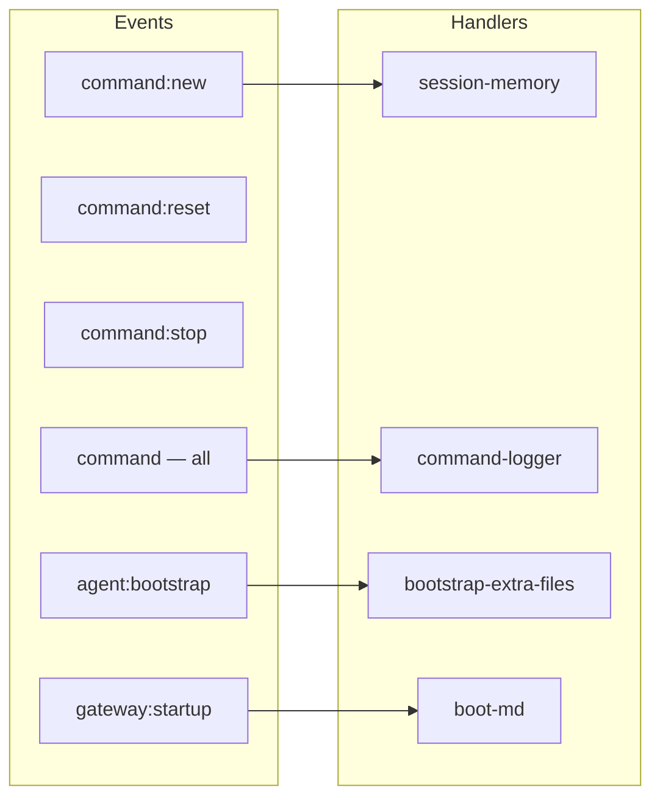

[< Back to README](./README.md) | [Prev: Plugins & Extensions](./08-plugin-and-extension-system.md) | [Consolidated Guide](./00-CONSOLIDATED-DEEP-DIVE.md)

# Hooks, Triggers, Heartbeats, Crons & Webhooks

OpenClaw has a rich automation layer that goes well beyond "message in → reply out." This doc covers the five interconnected systems that make agents proactive, schedulable, and externally triggerable.

---

## How They All Fit Together



---

## 1. Message Triggers (Auto-Reply Engine)

The auto-reply engine decides **if and how** to respond to an inbound message.

### Trigger Types



| Trigger | Context | When It Fires |
|---------|---------|---------------|
| **DM** | Direct message | Always, if sender is in allowlist |
| **@mention** | Group chat | `@agentname` appears in message |
| **Reply-to** | Group chat | Message is a reply to the agent's message |
| **Role mention** | Group chat (Discord/Slack) | `@everyone`, `@here` if configured |
| **Slash command** | Any | `/new`, `/reset`, `/stop`, `/model`, `/send`, `/compact`, `/status`, `/context` |
| **Inline command** | Any | `@agent /command` in group chats |

### Message Context (MsgContext)

Every inbound message is wrapped in a context object:

```typescript
{
  Body: string,              // Full message with envelope metadata
  RawBody: string,           // Plain text only
  BodyForAgent: string,      // Clean text sent to the model
  BodyForCommands: string,   // Text used for command parsing
  ChatType: "dm" | "group" | "channel",
  SenderId: string,          // Sender identifier
  SenderName: string,        // Display name
  Channel: string,           // "whatsapp" | "telegram" | "discord" | etc.
  Timestamp: Date,
  CommandAuthorized: boolean, // Has permission for /commands
  ThreadStarterBody?: string, // Thread/topic starter (if applicable)
  UntrustedContext?: string[], // External data (safety-wrapped)
}
```

### Inbound Debouncing

Rapid messages are batched to reduce redundant agent calls:

```json5
{
  messages: {
    inbound: {
      debounceMs: 500,          // Global debounce window
      byChannel: {
        telegram: 1000,         // Per-channel overrides
        whatsapp: 500
      }
    }
  }
}
```

Messages within the debounce window are buffered, then flushed together as a single agent invocation.

### Send Policy

Controls whether replies are actually delivered:

| Mode | Behavior |
|------|----------|
| `allow` | Always deliver replies |
| `deny` | Suppress reply delivery |
| `ask` | Prompt before delivering |
| `inherit` | Use channel default |

Runtime override via chat: `/send on`, `/send off`, `/send inherit`

### Command Queue Modes

When multiple messages arrive for the same session:

| Mode | Behavior |
|------|----------|
| `steer` | Route to correct agent, skip if already running |
| `followup` | Queue as followup to current run |
| `collect` | Batch messages into one agent turn |
| `interrupt` | Abort current run, start new one |

---

## 2. Heartbeats

Heartbeats are **periodic agent turns** in the main session. The agent wakes up, checks if anything needs attention, and either replies or stays silent.

### How Heartbeats Work



### Configuration

```json5
{
  agents: {
    defaults: {
      heartbeat: {
        every: "30m",             // Cadence: "30m" | "1h" | "0m" (disabled)
        model: "anthropic/claude-opus-4-6", // Optional model override
        target: "last",           // "last" | "none" | "<channel-id>"
        to: "+15551234567",       // Channel-specific target
        prompt: "...",            // Custom prompt (overrides default)
        ackMaxChars: 300,         // Max chars after HEARTBEAT_OK before delivery
        includeReasoning: false,  // Deliver reasoning as separate message
        activeHours: {
          start: "08:00",         // Local time start
          end: "22:00"            // Local time end
        }
      }
    }
  }
}
```

### Default Prompt

```
Read HEARTBEAT.md if it exists (workspace context). Follow it strictly.
Do not infer or repeat old tasks from prior chats.
If nothing needs attention, reply HEARTBEAT_OK.
```

### HEARTBEAT.md Template

Lives in the agent workspace. This is what the agent reads each heartbeat:

```markdown
# Heartbeat

_This file defines what the agent checks on each periodic heartbeat._

## Periodic Tasks

<!-- Add tasks here, e.g.: -->
<!-- - Check inbox for urgent emails -->
<!-- - Review calendar for upcoming meetings -->
<!-- - Check GitHub notifications -->

## Rules

- If nothing needs attention, reply HEARTBEAT_OK
- Only alert on genuinely urgent or time-sensitive items
- Don't repeat old context from prior sessions
```

### Response Contract

| Response | What Happens |
|----------|-------------|
| `HEARTBEAT_OK` alone | Silently dropped (nothing to report) |
| `HEARTBEAT_OK` + short text (≤ 300 chars) | Dropped (acknowledgment with minor note) |
| `HEARTBEAT_OK` + long text (> 300 chars) | Token stripped, content delivered as alert |
| Any other content | Delivered as normal message |

### Wake Reasons & Priority

| Reason | Priority | Source |
|--------|----------|--------|
| RETRY | 0 (highest) | Failed heartbeat retry with backoff |
| INTERVAL | 1 | Scheduled timer tick |
| DEFAULT | 2 | General requests |
| ACTION | 3 | Manual wake, exec event, hook |

Multiple wake requests within 250ms coalesce into one execution.

### Heartbeat Events

```typescript
{
  status: "sent" | "ok-empty" | "ok-token" | "skipped" | "failed",
  ts: number,
  to?: string,
  preview?: string,           // First N chars of response
  durationMs?: number,
  hasMedia?: boolean,
  reason?: string,
  channel?: string,
  silent?: boolean,           // Response was suppressed
  indicatorType?: "ok" | "alert" | "error"
}
```

---

## 3. Cron Jobs

Cron is the Gateway's built-in scheduler. Jobs persist across restarts, run at precise times, and can optionally deliver output to chat.

### Cron Job Anatomy



### Schedule Types

| Kind | Format | Example | Repeat |
|------|--------|---------|--------|
| `at` | ISO 8601 or relative | `"2026-03-01T09:00:00"`, `"20m"` | One-shot (auto-delete) |
| `every` | Duration in ms | `"4h"`, `"30m"` | Repeating |
| `cron` | 5-field cron + tz | `"0 9 * * *"` + `"America/New_York"` | Repeating |

### Session Targets

| Target | Session Key | Context | Use Case |
|--------|------------|---------|----------|
| `main` | Main agent session | Full conversation history | Quick events, reminders |
| `isolated` | `cron:<jobId>` | Fresh each run | Heavy tasks, reports |

### Payload Types

**System Event (main session):**
```json5
{
  kind: "systemEvent",
  text: "Check calendar for standup"   // Queued as system event
}
```

**Agent Turn (isolated session):**
```json5
{
  kind: "agentTurn",
  message: "Summarize overnight updates",  // Prompt text
  model: "openai/gpt-4o",                  // Optional model override
  thinking: "medium",                       // Optional reasoning level
  timeoutSeconds: 120                       // Optional timeout
}
```

### Delivery Configuration (Isolated Only)

```json5
{
  delivery: {
    mode: "announce",            // "announce" | "none"
    channel: "whatsapp",         // Target channel
    to: "+15551234567",          // Channel-specific target
    bestEffort: true             // Don't fail if delivery fails
  }
}
```

### CLI Examples

```bash
# One-shot reminder in 15 minutes
openclaw cron add \
  --name "Meeting reminder" \
  --at "15m" \
  --session main \
  --system-event "Standup starts in 10 minutes" \
  --wake now --delete-after-run

# Daily morning brief at 9am ET
openclaw cron add \
  --name "Morning brief" \
  --cron "0 9 * * *" --tz "America/New_York" \
  --session isolated \
  --message "Summarize inbox and calendar for today" \
  --announce --channel whatsapp --to "+15551234567"

# Every 4 hours status check
openclaw cron add \
  --name "Status check" \
  --every "4h" \
  --session main \
  --system-event "Time for periodic status check" \
  --wake now

# List, run, inspect
openclaw cron list
openclaw cron run <jobId>
openclaw cron runs --id <jobId>
```

### State Tracking

Each job tracks execution state:

```typescript
{
  nextRunAtMs: number,
  lastRunAtMs: number,
  lastStatus: "ok" | "error" | "skipped",
  lastError?: string,
  lastDurationMs: number,
  consecutiveErrors: number,    // For backoff
  scheduleErrorCount: number    // Auto-disable threshold
}
```

### Cron vs Heartbeat Decision Guide

| Need | Use |
|------|-----|
| "Check inbox every 30 min" | **Heartbeat** — periodic awareness in main session |
| "Send report at 9am daily" | **Cron (isolated)** — scheduled task with delivery |
| "Remind me in 20 minutes" | **Cron (at)** — one-shot timer |
| "Run health check every 4h" | **Cron (isolated)** — heavy task, fresh context |
| "Stay aware of urgent items" | **Heartbeat** — lightweight, uses main context |
| "Process webhook data nightly" | **Cron (isolated)** — batch processing |

---

## 4. Webhooks

Webhooks let external systems trigger the agent via HTTP. Two endpoints: **wake** (nudge main session) and **agent** (run isolated task).

### Endpoint Overview

```
POST /hooks/wake    → Enqueue system event in main session
POST /hooks/agent   → Run isolated agent turn
POST /hooks/<name>  → Custom mapped endpoints
```

### Authentication

**Required on every request** (one of):
- `Authorization: Bearer <token>` (recommended)
- `x-openclaw-token: <token>`

Query-string tokens are **rejected** (400). Repeated auth failures are rate-limited per IP with `Retry-After` headers.

### POST /hooks/wake

Nudge the main session with a system event.

```bash
curl -X POST http://127.0.0.1:18789/hooks/wake \
  -H 'Authorization: Bearer SECRET' \
  -H 'Content-Type: application/json' \
  -d '{"text": "New email from boss@company.com", "mode": "now"}'
```

| Field | Required | Description |
|-------|----------|-------------|
| `text` | Yes | System event text queued in main session |
| `mode` | No | `"now"` (immediate heartbeat) or `"next-heartbeat"` (default) |

**Response**: `200 OK`

### POST /hooks/agent

Trigger an isolated agent run.

```bash
curl -X POST http://127.0.0.1:18789/hooks/agent \
  -H 'Authorization: Bearer SECRET' \
  -H 'Content-Type: application/json' \
  -d '{
    "message": "Summarize this email and draft a reply",
    "name": "Email Handler",
    "wakeMode": "now",
    "deliver": true,
    "channel": "whatsapp",
    "to": "+15551234567"
  }'
```

| Field | Required | Description |
|-------|----------|-------------|
| `message` | Yes | Agent prompt |
| `name` | No | Human-readable label |
| `agentId` | No | Target agent (must be in allowlist) |
| `sessionKey` | No | Custom session key (disabled by default) |
| `wakeMode` | No | `"now"` or `"next-heartbeat"` |
| `deliver` | No | Deliver response to channel (default: true) |
| `channel` | No | Target channel for delivery |
| `to` | No | Channel-specific target |
| `model` | No | Model override |
| `thinking` | No | Reasoning level override |
| `timeoutSeconds` | No | Timeout override |

**Response**: `202 Accepted` (async)

### Custom Webhook Mappings

Map external services to named endpoints:

```json5
{
  hooks: {
    mappings: [
      {
        path: "/gmail",
        match: { source: "gmail" },
        action: "wake",                // or "agent"
        templates: { text: "Gmail: {subject}" },
        deliver: true,
        channel: "whatsapp"
      }
    ],
    presets: ["gmail"]   // Built-in Gmail mapping
  }
}
```

### Security Configuration

```json5
{
  hooks: {
    enabled: true,
    token: "${OPENCLAW_HOOKS_TOKEN}",
    path: "/hooks",
    allowedAgentIds: ["hooks", "main"],       // Restrict agent routing
    defaultSessionKey: "hook:ingress",         // Fixed session key
    allowRequestSessionKey: false,             // Block caller overrides
    allowedSessionKeyPrefixes: ["hook:"]       // Restrict prefixes if enabled
  }
}
```

### Response Codes

| Code | Meaning |
|------|---------|
| `200` | `/wake` success |
| `202` | `/agent` accepted (async) |
| `400` | Invalid payload or query-string token |
| `401` | Auth failure |
| `413` | Payload too large |
| `429` | Rate limited (`Retry-After` header) |

---

## 5. Gateway Hooks (Internal Hooks)

Event-driven automation scripts that respond to agent lifecycle events.

### Hook Event Types



| Event | When | What Hooks Can Do |
|-------|------|-------------------|
| `command:new` | `/new` issued | Save session to memory before reset |
| `command:reset` | `/reset` issued | Cleanup, log |
| `command:stop` | `/stop` issued | Log, notify |
| `command` | Any command | Audit logging |
| `agent:bootstrap` | Before system prompt | Add/swap/remove bootstrap files |
| `gateway:startup` | After channels start | Run boot scripts, initialize services |

### Hook Discovery & Loading

```
Discovery Order (last wins on conflict):
  extra dirs (configured) → bundled → managed → workspace

Directory Structure:
  my-hook/
  ├── HOOK.md          # Metadata (events, emoji, requirements)
  └── handler.ts       # Handler implementation
```

### HOOK.md Metadata

```yaml
---
name: my-hook
description: "What this hook does"
metadata:
  openclaw:
    emoji: "🎯"
    events: ["command:new", "agent:bootstrap"]
    requires:
      bins: ["git"]           # All must be on PATH
      anyBins: ["node", "bun"] # At least one
      env: ["MY_API_KEY"]     # Required env vars
      os: ["darwin", "linux"] # Required platforms
---
```

### Handler Implementation

```typescript
// handler.ts
import type { InternalHookEvent } from "openclaw";

export default async function handler(event: InternalHookEvent) {
  // event.type: "command" | "session" | "agent" | "gateway"
  // event.action: "new" | "reset" | "stop" | "bootstrap" | "startup"
  // event.sessionKey: session identifier
  // event.timestamp: when event occurred
  // event.messages: push strings to send user feedback
  // event.context: { sessionEntry, sessionId, workspaceDir, cfg, ... }

  if (event.action === "new") {
    // Save session memory before reset
    event.messages.push("Session saved to memory.");
  }

  if (event.action === "bootstrap") {
    // Mutate bootstrap files
    event.context.bootstrapFiles.push({
      name: "EXTRA.md",
      path: "/path/to/EXTRA.md"
    });
  }
}
```

### Bundled Hooks

| Hook | Emoji | Events | What It Does |
|------|-------|--------|-------------|
| **session-memory** | 💾 | `command:new` | Saves last N messages to `memory/YYYY-MM-DD-slug.md` before session reset. Uses LLM to generate descriptive filename. |
| **command-logger** | 📝 | `command` | Logs all commands to `~/.openclaw/logs/commands.log` (JSONL) |
| **bootstrap-extra-files** | 📎 | `agent:bootstrap` | Injects additional files via glob patterns into system prompt |
| **boot-md** | 🚀 | `gateway:startup` | Runs `BOOT.md` script when gateway starts |

### Configuration

```json5
{
  hooks: {
    internal: {
      enabled: true,
      entries: {
        "session-memory": {
          enabled: true,
          messages: 20          // Extract last 20 messages
        },
        "command-logger": { enabled: true },
        "bootstrap-extra-files": {
          enabled: true,
          paths: ["docs/*.md", "context/**/*.md"]
        }
      },
      load: {
        extraDirs: ["/path/to/custom-hooks"]
      }
    }
  }
}
```

### CLI

```bash
openclaw hooks list           # List all discovered hooks
openclaw hooks enable <name>  # Enable a hook
openclaw hooks disable <name> # Disable a hook
openclaw hooks check          # Check eligibility of all hooks
openclaw hooks info <name>    # Detailed hook information
```

---

## 6. Plugin Hooks (Lifecycle Hooks)

Separate from gateway hooks — these are registered by plugins via the Plugin API.

| Plugin Hook | When | Execution |
|-------------|------|-----------|
| `gateway_start` | Gateway starting | Parallel, fire-and-forget |
| `gateway_stop` | Gateway stopping | Parallel, fire-and-forget |
| `tool_result_persist` | Before tool result written to session | Synchronous, can transform |

### Registration (Plugin Code)

```typescript
api.registerHook(["gateway_start"], async (event) => {
  // Initialize plugin services
});

api.registerHook(["tool_result_persist"], (event) => {
  // Synchronously transform tool results before persistence
  return transformedResult;
});
```

### Gateway Hooks vs Plugin Hooks

| Aspect | Gateway Hooks | Plugin Hooks |
|--------|--------------|-------------|
| **Events** | command, agent, gateway, session | gateway_start/stop, tool_result_persist |
| **Discovery** | Directory scanning + HOOK.md | Plugin API registration |
| **Config** | `hooks.internal.entries` | Via plugin config |
| **Eligibility** | bins, env, os, config checks | Handled by plugin |
| **Execution** | Async, sequential per event | start/stop: parallel; persist: sync |
| **Use case** | Core automation (memory, logging) | Plugin-specific integration |

---

## 7. The Full Automation Picture

### Combined Configuration Example

```json5
{
  // ── Message triggers ──
  messages: {
    inbound: {
      debounceMs: 500,
      byChannel: { telegram: 1000 }
    }
  },

  // ── Heartbeat ──
  agents: {
    defaults: {
      heartbeat: {
        every: "30m",
        target: "last",
        activeHours: { start: "08:00", end: "22:00" },
        ackMaxChars: 300
      }
    }
  },

  // ── Cron ──
  cron: {
    enabled: true
  },

  // ── Webhooks ──
  hooks: {
    enabled: true,
    token: "${OPENCLAW_HOOKS_TOKEN}",
    defaultSessionKey: "hook:ingress",
    allowRequestSessionKey: false,
    presets: ["gmail"]
  },

  // ── Gateway hooks ──
  hooks: {
    internal: {
      enabled: true,
      entries: {
        "session-memory": { enabled: true },
        "command-logger": { enabled: true },
        "boot-md": { enabled: true }
      }
    }
  }
}
```

### How Systems Interact

```
┌─────────────────────────────────────────────────────────────┐
│  External World                                              │
│                                                              │
│  Messages ──→ Auto-Reply Engine ──→ Agent Loop               │
│                     │                    │                    │
│                     │ /new,/reset        │ lifecycle events   │
│                     ▼                    ▼                    │
│              Gateway Hooks         Plugin Hooks               │
│              (session-memory,      (tool_result_persist,      │
│               command-logger)       gateway_start/stop)       │
│                                                              │
│  Webhooks ──→ /hooks/wake ──→ Main Session (system event)    │
│           ──→ /hooks/agent ──→ Isolated Session (agent run)  │
│                                                              │
│  Cron ──→ main target ──→ System event → Heartbeat picks up │
│       ──→ isolated target ──→ Fresh agent run → Delivery     │
│                                                              │
│  Heartbeat ──→ Periodic turn in main session                 │
│            ──→ Check HEARTBEAT.md tasks                      │
│            ──→ HEARTBEAT_OK or alert                         │
└─────────────────────────────────────────────────────────────┘
```

### Choosing the Right Mechanism

| I want to... | Use |
|--------------|-----|
| Respond to user messages | **Message triggers** (auto-reply) |
| Run a task on a schedule | **Cron** (isolated for heavy, main for light) |
| Keep the agent periodically aware | **Heartbeat** |
| Trigger from external service | **Webhook** (/hooks/wake or /hooks/agent) |
| React to /new, /reset, /stop | **Gateway hooks** |
| Inject files into system prompt | **Gateway hook** (agent:bootstrap) |
| Transform tool results | **Plugin hook** (tool_result_persist) |
| Save session before reset | **Gateway hook** (session-memory) |
| Run a script at gateway boot | **Gateway hook** (boot-md) |
